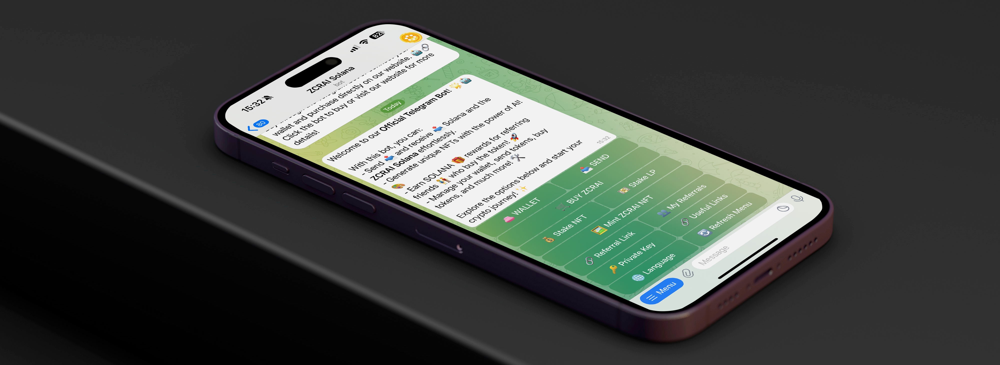

# 🤖 Bot Telegram

<figure><figcaption></figcaption></figure>

### Introdução 🌟

O bot do Telegram ZCRAI Solana é uma ferramenta inovadora que funciona como uma carteira descentralizada diretamente no Telegram. Com este bot, os usuários podem comprar tokens ZCRAI, enviar e receber SOL (a criptomoeda nativa da Solana) e ZCRAI, além de ter a oportunidade de gerar rendimentos através de um sistema de indicação. Nesta página, você aprenderá como utilizar o bot para gerenciar seus ativos e aproveitar as funcionalidades que ele oferece.

### Configurando o Bot 🛠️

Para começar a usar o bot do Telegram ZCRAI Solana, siga estes passos:

1. Acesse o link do bot: https://t.me/ZCRAISolBot.
2. No Telegram, inicie uma conversa com o bot clicando em "Start" ou "Iniciar".
3. O bot fornecerá instruções para configurar sua carteira, incluindo a criação ou importação de uma chave privada.

### Acesso à Chave Privada 🔐

Com o bot ZCRAI Solana, você tem acesso total à sua chave privada. Isso significa que você tem controle total sobre seus ativos e pode importar sua carteira em qualquer outra plataforma compatível com Solana. Certifique-se de manter sua chave privada em um local seguro e nunca compartilhá-la com ninguém.

### Comprando ZCRAI 💰

Para comprar tokens ZCRAI através do bot, siga as instruções fornecidas pelo bot. Você poderá realizar a compra utilizando SOL. O processo é intuitivo e projetado para ser acessível até mesmo para usuários iniciantes.

### Enviando e Recebendo SOL e ZCRAI 💸

O bot permite que você envie e receba SOL e ZCRAI de forma rápida e prática. Para realizar uma transferência, basta seguir os comandos do bot e inserir o endereço da carteira do destinatário. Para receber, forneça seu endereço da carteira Solana para a parte remetente.

### Gerando Rendimentos com o Sistema de Indicação 🤑

O bot do Telegram ZCRAI Solana oferece um sistema de indicação que permite que você ganhe recompensas cada vez que alguém usa seu link de indicação para fazer uma compra. Para participar:

1. Solicite seu link de indicação exclusivo através do bot.
2. Compartilhe seu link com amigos e conhecidos interessados em comprar ZCRAI.
3. Ganhe uma comissão por cada compra realizada através do seu link, sem limites.

### Conclusão 🎉

O bot do Telegram ZCRAI Solana é uma maneira conveniente e segura de gerenciar seus ativos na rede Solana. Com acesso à sua chave privada, facilidade de transações e um sistema de indicação lucrativo, o bot torna a experiência de investir em ZCRAI acessível e gratificante. Lembre-se de sempre praticar boas medidas de segurança e nunca compartilhar suas chaves privadas.

Para começar a usar o bot e explorar todas as suas funcionalidades, acesse o [ZCRAI Solana Bot](https://t.me/ZCRAISolBot) no Telegram. 🚀
