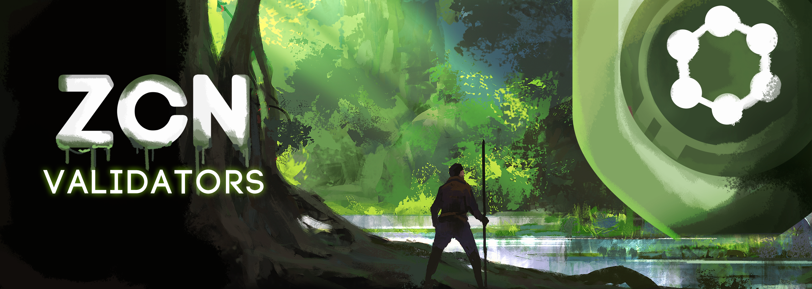

# ✅ Validadores

<figure><figcaption></figcaption></figure>

## O Sistema de Validadores da Rede ZCN 🌐

A Rede ZCN da ZCore Network oferece um sistema de validação inovador 🚀, combinando a confiabilidade da tecnologia blockchain com a exclusividade dos NFTs.

### Limitação e Representação dos Validadores 🔒

Com um limite estratégico de 40 validadores, a rede ZCN assegura uma distribuição equilibrada do poder de validação. Estes validadores são encarnados por NFTs "ZCN Validators", promovendo um sistema de governança justo e controlado.

### Requisitos para Ser um Validador 🛠️

Para se tornar um validador na Rede ZCN, é necessário:

* **NFT Validador:** Possuir um NFT da coleção ZCN Validators.
* **Stake de ZCR:** Realizar um stake mínimo de 10 milhões de ZCR.
* **Infraestrutura Técnica:** Manter um VPS (Virtual Private Server) ativo com o software de validação.

### Mecânica de Recompensa e Processo de Validação 💰

Validadores são recompensados por cada bloco validado, seguindo um sistema de fila que assegura uma distribuição equitativa das recompensas. Além disso, os validadores também recebem 1% das vendas de ZCR na Binance Smart Chain (BSC), proporcionando um fluxo de rendimento adicional tanto na rede BSC quanto na rede ZCN.

### Adquirindo um NFT Validador 🛒

Interessados em adquirir um NFT Validador e se juntar ao grupo exclusivo de validadores da ZCN devem entrar em contato com a equipe ZCore pelo e-mail: [info@zcore.network](mailto:info@zcore.network).

### Conclusão ✨

O sistema de validadores da Rede ZCN é uma harmonia perfeita de inovação e tecnologia blockchain, criando um ambiente seguro e eficiente. A integração de NFTs traz um elemento único e confere um sistema de validação robusto. Com a vantagem de ganhos na rede ZCN e participação nas vendas na BSC, os validadores desempenham um papel vital na sustentação da integridade e no avanço do ecossistema ZCore. 🌟
